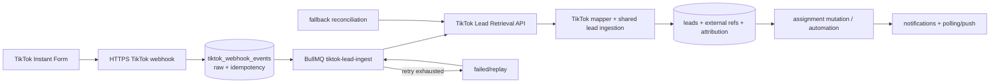

# Đánh giá khả năng tích hợp TikTok Lead Generation vào Admission CRM

Ngày đánh giá: 2026-09-07  
Phạm vi: đọc repository hiện tại và đối chiếu tài liệu first-party của TikTok. Không thay đổi code sản phẩm.

## Tóm tắt điều hành

**Kết luận: có thể tích hợp trực tiếp TikTok Lead Generation mà không cần viết lại hệ thống.** Mức sẵn sàng hiện tại được đánh giá khoảng **60/100**: CRM đã có nền tảng dữ liệu lead, form/webhook chung, raw submission, mapping, duplicate handling, audit, assignment mutation, notification, PostgreSQL/Prisma và BullMQ/Redis. Tuy nhiên chưa có OAuth/provider integration, token encryption, TikTok event inbox/idempotency theo external lead ID, adapter TikTok, fallback reconciliation, Round Robin thật, webhook verification theo đặc tả TikTok và hạ tầng HTTPS/production được tài liệu hóa.

Điều kiện chặn production quan trọng nhất không phải framework mà là quyền và hợp đồng API: app TikTok phải được duyệt với `Lead Management > Leads Retrieval` và `Read Ad Account Information`; tài khoản authorize phải là Admin của ad account. Trước khi code webhook production, phải lấy được tài liệu/console của app đã duyệt để xác minh event name, payload, subscription request, chữ ký, challenge, ACK và retry. Tài liệu public truy cập được hiện chưa đủ để xác nhận các chi tiết đó.

## A. Tổng quan dự án hiện tại

### Stack và entry point

| Lớp | Hiện trạng có bằng chứng |
|---|---|
| Monorepo | npm workspaces gồm `apps/*`, `packages/*` (`package.json`). |
| Frontend | React `^19.2.6`, Vite `^8.0.14`, TypeScript `^6.0.3`, React Router `^7.15.1`, TanStack Query `^5.100.14`, TanStack Table `^8.21.3`, Tailwind 4, Zod 4 (`apps/web/package.json:10-35`). Entry point là `apps/web/src/main.tsx:10-28`, bọc `QueryClientProvider`, `BrowserRouter`, `AuthProvider`. |
| Backend | Express `^5.2.1`, TypeScript `^6.0.3`, Zod `^4.4.3` (`apps/api/package.json:27-50`). Entry point `apps/api/src/server.ts:8`; route composition tại `apps/api/src/app.ts:44-69`. |
| Database/ORM | PostgreSQL; Prisma/adapter-pg `^7.8.0` (`apps/api/package.json:27-38`), schema nguồn chạy ứng dụng tại `apps/api/prisma/schema.prisma`, client tại `apps/api/src/database/prisma.ts`. |
| Queue | BullMQ `^5.79.2`, ioredis `^5.11.1`; worker được import khi app khởi động (`apps/api/src/app.ts:30`), Redis config tại `apps/api/src/config/redis.ts`. |
| Local infra | `docker-compose.yml` hiện chỉ khai báo PostgreSQL 18; chưa có Redis service. |

Backend được tổ chức theo domain: auth, marketing/campaign/form, leads/sale, admission, student, notifications, audit, reporting, system và automations. Cách đặt TikTok hợp lý là module integration riêng để giao tiếp provider, nhưng mọi tạo/cập nhật lead phải đi qua một shared lead-ingestion/application service trong domain leads/marketing, không tạo một business flow song song.

### Authentication, authorization và scope

- Login dùng email/password, bcrypt và JWT access token (`apps/api/src/modules/auth/auth.service.ts:169-223`). TTL mặc định 28.800 giây qua `JWT_EXPIRES_IN_SECONDS` (`apps/api/src/config/env.ts`).
- Protected route dùng `requireAuthentication` và `requireAnyPermission` (`apps/api/src/middlewares/auth.middleware.ts:14-49`).
- `AuthUser` mang roles, permissions, department IDs và scope; query lead áp `getLeadScopeWhere` (`apps/api/src/modules/leads/lead-list.service.ts:41`).
- TikTok connect/disconnect/sync phải có permission riêng, ví dụ `integration.tiktok.view` và `integration.tiktok.manage`; không hard-code role `ADMIN`. Scope phải gắn connection/advertiser với `institution_program_id` hoặc tenant boundary tương đương.

### Lead intake, validation, duplicate và attribution hiện có

- API lead thủ công là `POST /api/leads`, yêu cầu auth + `lead.create`, validate Zod (`apps/api/src/modules/leads/leads.router.ts:35-127`, `:221-252`). Phone hiện bị giới hạn đúng 10 chữ số.
- `createLead` kiểm tra trùng bằng `phone.trim()`, tạo lead, owner/assignment, activity, audit và kích hoạt automation `lead_created` (`apps/api/src/modules/leads/lead-management.service.ts:255-326`).
- Public form và external webhook chung hiện có tại `POST /api/public/forms/:publicKey/submit` và `POST /api/public/webhooks/forms/:publicKey` (`apps/api/src/modules/campaigns/marketing-reference.router.ts:381-437`). Webhook dùng `x-webhook-secret` và in-memory rate limit 30 request/phút/IP/form.
- Form engine lưu `raw_payload`, `normalized_payload`, answers và trạng thái vào `marketing_form_submissions` (`apps/api/prisma/schema.prisma:576-599`); có field mapping, required validation, duplicate theo phone/email và update/skip behavior (`apps/api/src/modules/campaigns/marketing-form-public.service.ts:189-367`).
- Chuẩn hóa phone của form hiện chỉ bỏ whitespace (`marketing-form-public.service.ts:36-38`). Email không được canonicalize về lowercase. Đây chưa đủ cho `+84`, `84`, `0`, dấu chấm/gạch và dữ liệu quốc tế.
- `utm_trackings` đã có `leadgen_form_id`, `leadgen_adgroup_id`, `fbclid` và metadata marketing (`apps/api/prisma/schema.prisma:939-966`), nhưng chưa có generic provider/external lead identity hoặc TikTok advertiser/ad IDs.
- Có dữ liệu demo gắn nhãn Facebook/Google, nhưng **chưa tìm thấy trong code** client OAuth/API/webhook chuyên biệt cho Facebook Lead Ads hoặc Google Forms. Không nên xem demo platform/UTM là một integration đã hoàn chỉnh.

### Assignment, notification, audit và retry

- `assignVisibleLead` kiểm tra permission/scope, cập nhật main assignment, `leads.assigned_to`, activity, notification và audit trong transaction (`apps/api/src/modules/leads/lead-owner-stage-mutations.service.ts:64-130`).
- Automation có action gán một user cố định (`action_assign`), notification, stage, activity; queue job có 3 attempts, exponential backoff 5 giây, deterministic job ID và persisted execution state (`apps/api/src/modules/automations/automation-engine.service.ts:44-61`, `:158-234`).
- **Chưa tìm thấy trong code** thuật toán Round Robin/cursor/locking để chọn sales kế tiếp. Action assign hiện yêu cầu `assignToUserId` cố định.
- Notification được lưu DB. Frontend polling mỗi 60 giây (`apps/web/src/modules/notifications/components/personal-notifications-dialog.tsx:15`); **chưa tìm thấy trong code** Socket.IO, WebSocket hoặc SSE. Vì vậy hiện chưa phải realtime đúng nghĩa.
- Audit table có actor, entity, action, old/new JSON, IP và timestamp (`apps/api/prisma/schema.prisma:86-103`). Global error handler log nguyên error rồi trả 500 (`apps/api/src/app.ts:71-78`); cần redaction để provider token/PII không lọt vào log.

### Environment, deployment và secrets

- `.env.example` chỉ có DB, web origin, JWT, port và Redis. App secret/access token bên thứ ba và encryption key **chưa tìm thấy trong code**.
- Webhook secret của marketing form hiện lưu plaintext trong DB (`marketing_forms.webhook_secret`, `apps/api/prisma/schema.prisma:490-491`). Cách này không phù hợp để sao chép cho TikTok access token.
- `docs/deployment.md` chỉ là placeholder; **chưa tìm thấy trong code/repo** reverse proxy, production domain, certificate/HTTPS, Dockerfile, managed secret store hoặc deployment pipeline.
- `docker-compose.yml` bind PostgreSQL ở localhost nhưng thiếu Redis dù API mặc định khởi tạo BullMQ worker. Cần hoàn thiện hạ tầng trước khi dựa vào queue trong production.

## B. Kết luận khả năng tích hợp

### Thành phần tái sử dụng được

1. Express router/service conventions, Zod validation và global `/api` routing.
2. PostgreSQL/Prisma và các bảng `leads`, `lead_sources`, `campaigns`, `marketing_forms`, `marketing_form_submissions`, `utm_trackings`.
3. Raw/normalized submission pattern, field mapping và configurable duplicate policy.
4. `assignVisibleLead` cho mutation phân công đúng audit/activity/notification.
5. BullMQ/Redis, persisted automation execution state và retry/backoff pattern.
6. Permission middleware, department/program scope và audit infrastructure.
7. Notification DB/UI, dù delivery hiện mới polling.

### Thành phần cần bổ sung hoặc chỉnh sửa

- Provider adapter TikTok Marketing API v1.3; OAuth state lifecycle; encrypted credential store.
- Connection/advertiser mapping, webhook inbox, provider identity/idempotency, sync/reconciliation log.
- Shared lead ingestion service để cả manual import, public form và TikTok không nhân bản normalization/dedup/assignment/audit.
- Phone canonicalization theo E.164 hoặc canonical VN number, lowercase/trim email, và DB-level uniqueness phù hợp business policy.
- Round Robin thật nếu đây là yêu cầu bắt buộc; hiện chỉ có manual/fixed-user assignment.
- Provider-aware rate limiter dùng Redis, structured/redacted logs, metrics/alerting, replay/DLQ.
- HTTPS deployment và webhook verification theo contract TikTok được cấp cho app.
- SSE/WebSocket/Socket.IO nếu SLA thật sự cần push tức thời; nếu chấp nhận trễ tối đa 60 giây, polling hiện tại có thể dùng cho MVP.

### Có cần đổi kiến trúc không?

Không cần thay framework hay tách microservice. Cần **làm sâu module hiện tại** bằng một durable inbox + adapter + shared ingestion pipeline. TikTok module chỉ chịu OAuth/API/webhook/provider mapping; domain lead tiếp tục sở hữu dedup, create/update, assignment, activity, audit và notification.

### Redis/queue có bắt buộc không?

- Webhook phải persist event trước và trả 2xx nhanh. Điều bắt buộc là **durable inbox**, không phải Redis.
- MVP một instance có thể ghi `tiktok_webhook_events` rồi dùng DB polling/`setInterval` để xử lý; cách này đơn giản nhưng yếu về concurrency, visibility và scale.
- Vì repository đã có BullMQ/ioredis, khuyến nghị production dùng queue từ giai đoạn webhook, sau khi bổ sung Redis deployment/health check. DB event vẫn là source of truth; BullMQ chỉ vận chuyển job. Khi enqueue lỗi, dispatcher quét row `received/retryable` để enqueue lại.

### Có cần đổi database không?

Có, nhưng chỉ là migration tăng cường: integration credentials, advertiser mapping, raw event inbox, sync logs và generic external lead reference. Không nên nhét toàn bộ TikTok metadata/token vào `leads`.

## C. Gap Analysis

| Hạng mục | Hiện trạng | File liên quan | Cần làm | Ưu tiên |
|---|---|---|---|---|
| TikTok app/permission | Chưa tìm thấy trong code | `.env.example` | App review, Leads Retrieval, Read Ad Account Information | P0 |
| OAuth advertiser | Chưa có | auth/router conventions | state one-time TTL, callback, token exchange/revoke | P0 |
| Token storage | Chưa có; form secret plaintext | `schema.prisma:490-491` | AES-256-GCM/envelope encryption, key version, redaction | P0 |
| Public HTTPS | Chưa có production config | `docs/deployment.md` | domain, TLS, reverse proxy/load balancer, trusted proxy | P0 |
| TikTok webhook verification | Chưa xác minh contract chính thức | public webhook hiện tại | Chỉ implement sau khi có official payload/signature/challenge | P0 |
| Durable webhook inbox | Form submission đã lưu raw, nhưng không provider-idempotent | `marketing-form-public.service.ts:272` | `tiktok_webhook_events`, unique dedupe key, replay | P0 |
| External lead idempotency | Chưa có | `leads`, `utm_trackings` | generic `lead_external_refs` unique `(provider, external_lead_id)` | P0 |
| Canonical normalization | Phone chỉ trim/bỏ whitespace | `leads.router.ts:45`, `marketing-form-public.service.ts:36` | shared phone/email canonicalizer + tests | P0 |
| Shared ingestion | Manual và form tạo lead theo hai flow | `lead-management.service.ts`, `marketing-form-public.service.ts` | extract transaction-level ingest orchestration | P0 |
| Assignment | Manual/fixed user; chưa Round Robin | `lead-owner-stage-mutations.service.ts`, automation engine | selector có lock/cursor rồi gọi mutation dùng chung | P1 |
| Queue/retry | BullMQ đã có; Docker Compose thiếu Redis | automation engine, `docker-compose.yml` | TikTok queue/worker, reconciliation dispatcher, DLQ/replay | P1 |
| Realtime | DB + polling 60 giây | notification dialog | giữ polling MVP hoặc bổ sung SSE/WebSocket | P2 |
| Backfill | Chưa có | không có | watermark/cursor, download/retrieval API sau khi xác minh contract | P1 |
| Observability | Console error + execution logs | `app.ts:71`, automation logs | metrics, structured redacted logs, admin status/sync logs | P1 |
| Conversion postback | Chưa có | attribution/stage history có thể tái dùng | Events API phase sau, consent/data governance | P2 |

## D. Kiến trúc tích hợp đề xuất



File Mermaid độc lập: `deliverables/tiktok-lead-integration-architecture.mmd`.

Luồng xử lý:

1. Webhook nhận raw bytes/body; xác minh theo đúng TikTok contract đã được cấp.
2. Tính dedupe key từ event ID chính thức, hoặc `(provider, advertiser_id, external_lead_id)` khi contract cho phép; insert event bằng unique constraint.
3. Trả 2xx ngay sau durable insert; event trùng cũng trả success phù hợp contract.
4. Worker lấy canonical lead/form data từ TikTok nếu webhook chỉ gửi reference.
5. Adapter map field động qua form-field cache; không hard-code toàn bộ câu hỏi custom.
6. Shared ingestion normalize, resolve source/campaign/program, check external identity trước rồi mới check cross-source phone/email.
7. Transaction ghi lead hoặc merge theo policy, external ref, attribution, activity và audit.
8. Assignment selector chọn sales; mutation dùng lại `assignVisibleLead`/transaction primitive để tạo assignment, notification và audit.
9. Đánh dấu event processed. Lỗi transient retry có backoff; auth/revoked permission chuyển connection sang `degraded`; lỗi contract/validation vào failed/replay queue.
10. Reconciliation định kỳ dùng watermark/cursor và API/download task đã xác minh để bù event bị mất.

Lưu ý: public-form flow hiện không gọi `triggerAutomation("lead_created")` và tự tạo assignment/audit riêng. Trước khi nối TikTok, nên tách shared ingestion để tránh TikTok kế thừa sự không đồng nhất này.

## E. Danh sách API TikTok cần dùng

Base URL/API version đã xác minh: `https://business-api.tiktok.com/open_api/v1.3`. Nguồn tổng hợp endpoint/permission: [TikTok API for Business API reference](https://business-api.tiktok.com/gateway/docs/index?doc_id=1735713875563521&identify_key=c0138ffadd90a955c1f0670a56fe348d1d40680b3c89461e09f78ed26785164b&language=ENGLISH).

| API | Mục đích | Permission | Mức xác minh |
|---|---|---|---|
| `https://ads.tiktok.com/marketing_api/auth` | Advertiser authorization; params `app_id`, `state`, `scope`, `redirect_uri` | Các scope app xin | URL/params/callback đã xác minh; `auth_code` one-time, 1 giờ ([official concepts](https://business-api.tiktok.com/gateway/docs/index?doc_id=1738928364967937&identify_key=c0138ffadd90a955c1f0670a56fe348d1d40680b3c89461e09f78ed26785164b&language=ENGLISH)) |
| `POST /oauth2/access_token/` | Đổi `auth_code` lấy long-term Marketing API token | N/A | Đã xác minh |
| `POST /oauth/token/` | Biến thể token endpoint nhận JSON/form-urlencoded | N/A | Đã xác minh |
| `POST /oauth2/revoke_token/` | Revoke long-term token khi disconnect | N/A | Đã xác minh |
| `GET /oauth2/advertiser/get/` | Advertiser đã authorize | Read Ad Account Information | Method/endpoint/permission đã xác minh |
| `/lead/get/` | Lấy lead Instant Form/DM | Leads Retrieval | Endpoint/mục đích/permission đã xác minh; method/params/payload chưa đủ bằng chứng public |
| `/lead/field/get/` | Lấy fields của lead/form | Leads Retrieval | Endpoint/mục đích/permission đã xác minh; params/payload chưa đủ bằng chứng public |
| `GET /page/field/get/` | Lấy Instant Form fields theo advertiser/page | Test Leads | Đã xác minh ([official doc](https://business-api.tiktok.com/gateway/docs/index?doc_id=1739054080455681&identify_key=c0138ffadd90a955c1f0670a56fe348d1d40680b3c89461e09f78ed26785164b&language=ENGLISH)) |
| `/page/lead/mock/create/`, `/get/`, `/delete/` | Test lead | Test Leads | Endpoint/permission đã xác minh; contract đầy đủ chưa xác minh |
| `/page/lead/task/`, `/page/lead/task/download/` | Export/download lead | Test Leads theo permission table | Endpoint/permission đã xác minh; window/filter/task flow chưa xác minh |
| `/subscription/subscribe/`, `/get/`, `/unsubscribe/` | Generic subscription | Theo loại subscription | Endpoint generic đã xác minh; lead event/method/payload/signature chưa xác minh |
| `/event/track/` | Events API 2.0 CRM postback | Report Conversion Event | Đã xác minh |
| `/crm/list/`, `/crm/create/` | List/create CRM Event Set | Read/Create-Manage CRM Event Sets | Đã xác minh |

Không dùng `/tt_user/oauth2/*` và giả định access-token 1 ngày/refresh-token 1 năm của TikTok Account Login cho advertiser Marketing API. `/oauth2/refresh_token/` của Marketing API v1.3 đã deprecated theo [official deprecations](https://business-api.tiktok.com/gateway/docs/index?doc_id=1740579480076290&identify_key=c0138ffadd90a955c1f0670a56fe348d1d40680b3c89461e09f78ed26785164b&language=ENGLISH). Lifetime tuyệt đối của long-term token chưa được trang public nêu rõ; phải xử lý revoke/mất quyền/re-authorize.

### Những điểm chưa được tài liệu public xác minh

- Event có tên chính xác `LEAD` hay không; subscribe request cụ thể.
- Challenge handshake, raw payload, headers/chữ ký và thuật toán verify.
- ACK timeout, retry count/schedule/order.
- Exact rate limit/quota/response headers cho từng endpoint.
- Lead retrieval lookback, pagination/filter và backfill window.
- Long-term token absolute lifetime.
- Pricing/eligibility riêng cho API.

Các mục này phải được lấy từ developer console/API Playground/Postman/support của app đã duyệt trước khi đóng băng implementation.

## F. Database và API cần bổ sung

### Schema đề xuất

Không thêm TikTok token hoặc hàng loạt provider fields vào `leads`. Đề xuất các model rút gọn sau; migration thật phải bổ sung foreign keys/relations ngược phù hợp schema hiện tại.

```prisma
model tiktok_integrations {
  id                       String    @id @default(dbgenerated("gen_random_uuid()")) @db.Uuid
  institution_program_id   String?   @db.Uuid
  created_by               String?   @db.Uuid
  app_id                   String    @db.VarChar(100)
  access_token_encrypted   Bytes
  encryption_key_version   Int       @default(1)
  authorized_scopes        Json?
  status                   String    @default("pending") @db.VarChar(30)
  access_token_expires_at  DateTime? @db.Timestamp(6)
  last_verified_at         DateTime? @db.Timestamp(6)
  disconnected_at          DateTime? @db.Timestamp(6)
  created_at               DateTime  @default(now()) @db.Timestamp(6)
  updated_at               DateTime  @updatedAt @db.Timestamp(6)

  @@index([institution_program_id, status])
  @@index([created_by])
}

model tiktok_advertiser_accounts {
  id                     String    @id @default(dbgenerated("gen_random_uuid()")) @db.Uuid
  integration_id         String    @db.Uuid
  institution_program_id String?   @db.Uuid
  advertiser_id          String    @db.VarChar(100)
  advertiser_name        String?   @db.VarChar(255)
  status                 String    @default("active") @db.VarChar(30)
  sync_cursor             String?
  last_sync_at            DateTime? @db.Timestamp(6)
  created_at              DateTime  @default(now()) @db.Timestamp(6)
  updated_at              DateTime  @updatedAt @db.Timestamp(6)

  @@unique([integration_id, advertiser_id])
  @@index([institution_program_id, status])
}

model tiktok_webhook_events {
  id                    String    @id @default(dbgenerated("gen_random_uuid()")) @db.Uuid
  integration_id        String?   @db.Uuid
  advertiser_id         String?   @db.VarChar(100)
  external_event_id     String?   @db.VarChar(255)
  external_lead_id      String?   @db.VarChar(255)
  dedupe_key            String    @unique @db.VarChar(512)
  payload               Json
  status                String    @default("received") @db.VarChar(30)
  attempt_count         Int       @default(0)
  next_retry_at         DateTime? @db.Timestamp(6)
  processed_at          DateTime? @db.Timestamp(6)
  error_code            String?   @db.VarChar(100)
  error_message         String?
  received_at           DateTime  @default(now()) @db.Timestamp(6)

  @@index([status, next_retry_at, received_at])
  @@index([advertiser_id, external_lead_id])
}

model lead_external_refs {
  id               String   @id @default(dbgenerated("gen_random_uuid()")) @db.Uuid
  lead_id          String   @db.Uuid
  provider         String   @db.VarChar(30)
  external_lead_id String   @db.VarChar(255)
  advertiser_id    String?  @db.VarChar(100)
  form_id          String?  @db.VarChar(255)
  campaign_id      String?  @db.VarChar(255)
  adgroup_id       String?  @db.VarChar(255)
  ad_id            String?  @db.VarChar(255)
  created_at       DateTime @default(now()) @db.Timestamp(6)

  @@unique([provider, external_lead_id])
  @@index([lead_id])
  @@index([provider, advertiser_id, form_id])
}

model tiktok_sync_logs {
  id                    String    @id @default(dbgenerated("gen_random_uuid()")) @db.Uuid
  advertiser_account_id String    @db.Uuid
  requested_by          String?   @db.Uuid
  sync_type             String    @db.VarChar(30)
  status                String    @db.VarChar(30)
  cursor_from           String?
  cursor_to             String?
  received_count        Int       @default(0)
  created_count         Int       @default(0)
  merged_count          Int       @default(0)
  failed_count          Int       @default(0)
  error_message         String?
  started_at            DateTime  @default(now()) @db.Timestamp(6)
  completed_at          DateTime? @db.Timestamp(6)

  @@index([advertiser_account_id, started_at])
  @@index([status, started_at])
}
```

`access_token_encrypted` phải là ciphertext authenticated-encryption envelope (nonce/IV + auth tag + ciphertext, hoặc một binary envelope versioned), không phải base64 plaintext. Master key nằm ở secret manager/environment ngoài DB. Không đề xuất `refresh_token` vì advertiser Marketing API v1.3 dùng long-term token và refresh endpoint đã deprecated; chỉ thêm field nếu response contract chính thức của app thực tế trả và yêu cầu nó.

Raw event chứa PII nên có retention ngắn (ví dụ 30–90 ngày theo policy nội bộ đã duyệt), quyền truy cập hạn chế và job redaction/deletion. TikTok xác nhận Ads Manager giữ lead 90 ngày, nhưng đó không tự động là retention policy hợp pháp/phù hợp cho CRM ([official retention/security](https://ads.tiktok.com/help/article/about-leads-data-security?lang=en)).

### API nội bộ đề xuất

Theo convention Express hiện tại, mount `tiktokIntegrationsRouter` tại `/api/integrations/tiktok` và public webhook tại `/api/public/webhooks/tiktok`:

| Route | Bảo vệ | Mục đích |
|---|---|---|
| `POST /api/integrations/tiktok/oauth/connect` | JWT + `integration.tiktok.manage` + scope | Tạo one-time state, trả authorization URL |
| `GET /api/integrations/tiktok/oauth/callback` | OAuth state, không tin browser JWT | Verify state, exchange code, redirect về UI với opaque result |
| `GET /api/integrations/tiktok/status` | JWT + `integration.tiktok.view` + scope | Connection/advertiser health, không trả token |
| `GET /api/integrations/tiktok/advertisers` | JWT + `integration.tiktok.view` + scope | Danh sách advertiser đã authorize |
| `PUT /api/integrations/tiktok/advertisers/:advertiserId/mapping` | JWT + manage + scope | Map advertiser/form vào program/source/campaign |
| `POST /api/integrations/tiktok/subscriptions` | JWT + manage + scope | Subscribe sau khi contract chính thức được xác minh |
| `POST /api/integrations/tiktok/sync` | JWT + manage + scope + rate limit | Manual reconciliation/backfill có bounded window |
| `GET /api/integrations/tiktok/sync-logs` | JWT + view + scope, paginated | Theo dõi/replay lỗi |
| `DELETE /api/integrations/tiktok/connections/:id` | JWT + manage + scope | Revoke token, disable subscription, audit disconnect |
| `POST /api/public/webhooks/tiktok/leads` | TikTok verification + provider rate limit | Persist raw event/idempotent ACK; không chạy business flow inline |

Không dùng `GET` cho connect nếu route tạo OAuth state server-side; `POST` thể hiện đúng đây là state mutation. Callback vẫn là `GET` do browser redirect.

## G. Kế hoạch triển khai theo giai đoạn

### Giai đoạn 1 — Developer App và contract API

- Tạo TikTok for Business/developer profile/app; khai báo use case, privacy policy, redirect URLs.
- Xin tối thiểu Leads Retrieval và Read Ad Account Information; Test Leads nếu cần mock/download APIs.
- Thu thập official sample request/response/webhook từ console/Playground/Postman của app đã duyệt.
- Chốt privacy/retention/data-subject process trước khi nhận PII.

**Exit:** quyền đã approved và tám điểm “chưa xác minh” ở mục E có bằng chứng first-party.

### Giai đoạn 2 — OAuth và advertiser connection

- Migration integration/advertiser tables, key management, state TTL.
- Connect/callback/status/disconnect; encrypted token, revoke and degraded state.
- Permission/scope/audit tests.

### Giai đoạn 3 — Webhook và retrieval

- Raw-body middleware chỉ cho route TikTok nếu signature cần raw bytes.
- Verify/challenge/ACK đúng official contract; durable event inbox và unique dedupe.
- TikTok API client với timeout, bounded retry, error taxonomy, redacted logging.
- Queue/worker và reconciliation dispatcher.

### Giai đoạn 4 — Lead ingestion, dedup và assignment

- Extract shared normalizer/ingestion transaction.
- External ID first, cross-source phone/email second; explicit merge/skip/new policy.
- Map form/campaign/adgroup/ad/source and preserve raw answers.
- Round Robin transaction-safe nếu cần; reuse assignment mutation/audit/notification.

### Giai đoạn 5 — Testing và vận hành

- Unit: mapping, canonicalization, state, encryption envelope, signature fixtures, idempotency.
- Integration: duplicate delivery, out-of-order event, enqueue failure, TikTok 429/5xx, revoke, replay, concurrent Round Robin.
- E2E sandbox/test lead và reconciliation; dashboards/alerts/retention cleanup.
- Load test webhook ACK và worker throughput; backup/restore exercise.

### Giai đoạn 6 — Conversion postback (tùy chọn)

- Tạo/list CRM Event Set, map CRM stages/events, send `/event/track/` với `event_source=crm`.
- Dedupe outbound event, consent/governance, hashing/normalization theo official contract.
- TikTok khuyến nghị ưu tiên `lead_ID`; đây là lý do phải giữ `external_lead_id` ([official signal postback](https://ads.tiktok.com/resources/help/article/about-signal-postback-for-lead-quality-optimization?lang=nl-NL)).

## H. Checklist tài khoản và hạ tầng

### TikTok/doanh nghiệp

- [ ] TikTok for Business account và developer profile đã duyệt.
- [ ] Developer app, intended use, internal/external access và thị trường Việt Nam đủ điều kiện.
- [ ] Người authorize là Admin đúng ad account; Operator/Analyst không đủ quyền download/manage lead ([TikTok Leads Data Security](https://ads.tiktok.com/help/article/about-leads-data-security?lang=en)).
- [ ] Leads Retrieval + Read Ad Account Information; Test Leads nếu dùng mock/download.
- [ ] Privacy Policy URL và disclaimer/consent text cho Instant Form.
- [ ] Sample webhook/API contract first-party từ app console.

### Domain/server

- [ ] Production API domain cố định, public HTTPS, TLS renewal và redirect URL exact-match.
- [ ] Reverse proxy/load balancer giữ raw body/header cần verify; cấu hình trusted proxy/IP đúng.
- [ ] Firewall/WAF/provider-aware rate limit; không dựa vào in-memory IP limiter khi chạy nhiều instance.
- [ ] Redis production HA hoặc DB dispatcher plan; BullMQ health/worker lifecycle.
- [ ] PostgreSQL backup, PITR, indexes, retention cleanup, encryption at rest.
- [ ] Secret manager cho app secret, token-encryption master key và Events API token.
- [ ] Structured logs/metrics/alerts không chứa token, phone, email hoặc raw payload.

### Đội phát triển/vận hành

- [ ] Owner cho app review, OAuth incident, token revoke và privacy requests.
- [ ] Runbook re-authorize, replay, backfill và disconnect/delete.
- [ ] Test advertiser/form và lead test data không phải PII thật.
- [ ] SLA lead delivery, polling/push expectation và on-call alert threshold.

## I. Chi phí dự kiến

| Nhóm | Kết luận |
|---|---|
| TikTok API | Nguồn official đã kiểm tra không công bố bảng phí riêng cho Lead Retrieval/Custom API. **Chưa xác minh API miễn phí hay có phí/điều kiện riêng**; kiểm tra console/contract/account representative. |
| Quảng cáo | Ngân sách TikTok Ads là chi phí riêng, không đồng nghĩa phí API. |
| Hạ tầng bắt buộc | Public HTTPS/API hosting, PostgreSQL, backup, logs/metrics, secret management. |
| Hạ tầng khuyến nghị | Redis/BullMQ worker, alerting, WAF/rate limiting; chi phí tùy nhà cung cấp và SLA. |
| Phát triển/vận hành | App review, backend/frontend admin UI, testing sandbox, privacy/security review, incident/runbook. |
| Dịch vụ trung gian | Không có phí Zapier/Make vì thiết kế tích hợp trực tiếp. |

Không đưa con số tiền khi chưa có traffic/SLA/provider cloud và commercial terms.

## J. Bước tiếp theo và thứ tự file cần tạo/sửa

Chưa triển khai code cho đến khi Giai đoạn 1 hoàn tất. Khi đủ contract, thứ tự đề xuất:

1. `apps/api/src/config/env.ts`, `apps/api/.env.example` — TikTok app ID/secret, callback URL, encryption key reference; tuyệt đối không đưa token vào web env.
2. `apps/api/prisma/schema.prisma` + migration mới — integration, advertiser, event inbox, sync log, external refs và permission seed.
3. `apps/api/src/modules/integrations/tiktok/tiktok.types.ts` và `tiktok.client.ts` — contracts/provider API, timeout/error redaction.
4. `tiktok.crypto.ts`, `tiktok-oauth-state.service.ts`, `tiktok-integration.service.ts` — encryption/state/connection lifecycle.
5. `tiktok.router.ts` và `tiktok-webhook.router.ts` — protected admin APIs và public verified webhook.
6. `tiktok-lead-mapper.ts`, `tiktok-sync.service.ts`, `tiktok-worker.ts` — mapping, queue, retry/replay/reconciliation.
7. Refactor `apps/api/src/modules/leads/lead-management.service.ts` và `apps/api/src/modules/campaigns/marketing-form-public.service.ts` — shared `lead-ingestion.service.ts`; không thay đổi public behavior ngoài phần đã test.
8. `lead-normalization.ts` + focused tests — phone/email canonicalization và cross-source duplicate policy.
9. `lead-assignment-selector.service.ts` — Round Robin có DB lock/cursor, sau đó gọi transaction primitive dùng chung từ `lead-owner-stage-mutations.service.ts`.
10. `apps/api/src/app.ts` — mount routers/raw-body handling; `docker-compose.yml` và `docs/deployment.md` — Redis/HTTPS/worker/runbook.
11. `apps/web/src/modules/integrations/tiktok/*` — UI tiếng Việt cho kết nối, advertiser mapping, status và sync logs; permission-gated navigation.
12. Nếu cần push thật: notification SSE/WebSocket backend + frontend; nếu không, giữ polling 60 giây và ghi rõ SLA.

## Nguồn và giới hạn xác minh

Nghiên cứu TikTok first-party chi tiết nằm tại `docs/research/tiktok-lead-generation-official-research.md`. TikTok xác nhận Custom API with Webhooks là một phương thức CRM chính thức ([available CRM integrations](https://ads.tiktok.com/help/article/available-crm-integrations-tiktok-lead-generation?lang=en-GB)); Ads Manager giữ lead 90 ngày ([access Instant Form leads](https://ads.tiktok.com/resources/help/article/access-leads-data-on-instant-forms?lang=en)). Mọi endpoint/contract không đủ bằng chứng public đều được đánh dấu “chưa xác minh”, không được dùng làm implementation contract.
